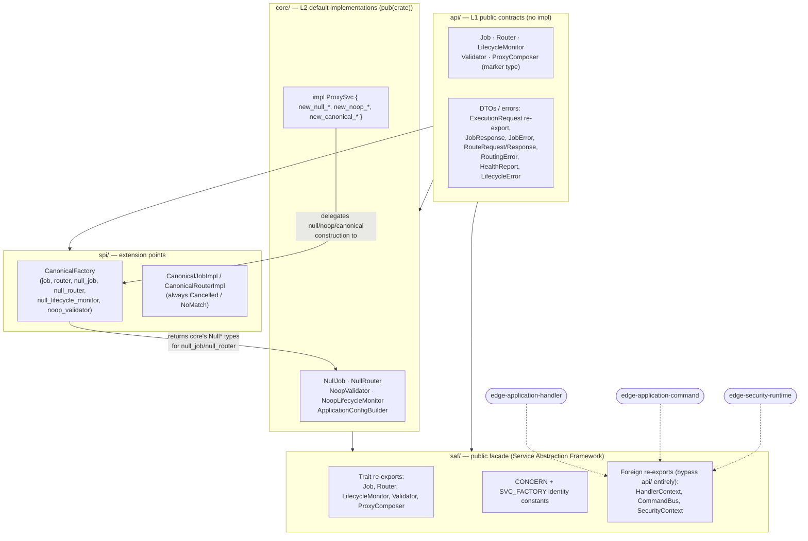
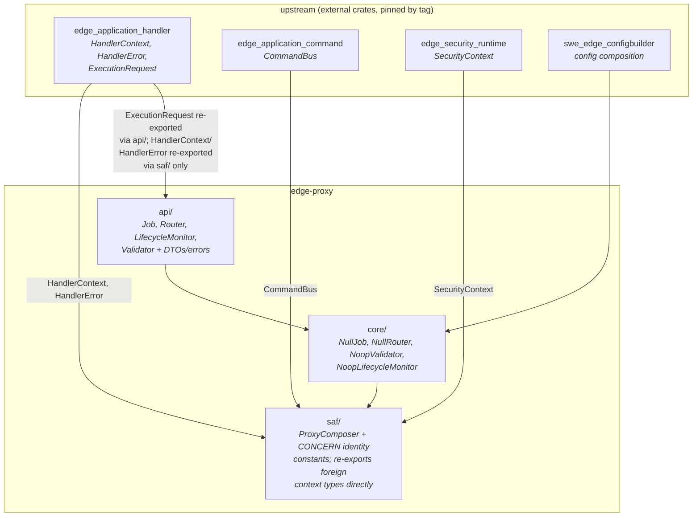
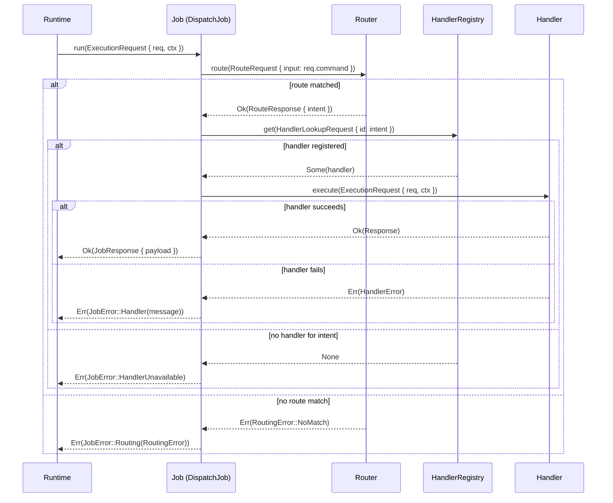
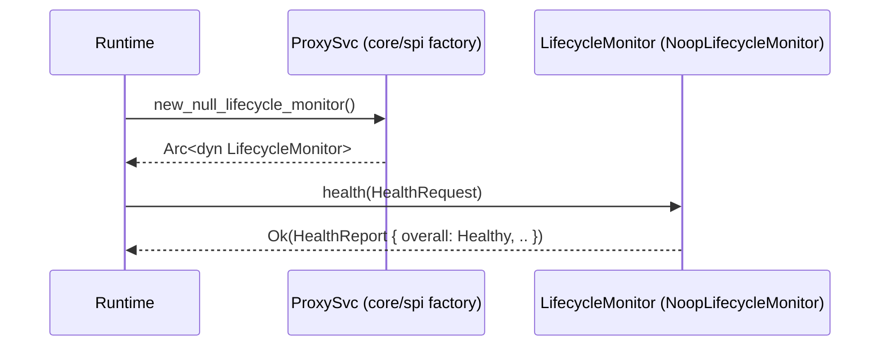

# edge-proxy Architecture

**Audience:** Developers and architects working in this repo, and any agent (human or AI)
picking up dispatch-facade work here.

This is the entry point for understanding how `edge-proxy` is structured internally and what it
depends on. It synthesizes the ADRs in `docs/adr/` and the crate's own public surface
(`main/src/lib.rs`); it does not duplicate either, it points at them.

---

## What this repo is

`edge-proxy` (package `edge-proxy`, crate root `edge_proxy`) is a single-crate, SEA-compliant
(`api/` → `core/` → `saf/` → `spi/`) Rust library defining the L2 dispatch facade for swe-edge — the
contract layer between an inbound runtime/transport and the domain layer, with **no transport
knowledge of its own** (no ingress/egress imports).

It declares four contract traits, each one concern of what its own source calls the "5-Concern
Controller pattern":

- **`Job<Request, Response>`** — the single entry point; `run(ExecutionRequest<'_, Request>) ->
  Result<JobResponse<Response>, JobError>`. Note the generic trait parameters (`Request`,
  `Response` on the trait itself, defaulting to `String`) — a different polymorphism shape than
  `edge-application-handler`'s `Handler`, which fixes `Request`/`Response` as associated types.
- **`Router<Intent>`** — classifies input into a domain-specific intent/route id.
- **`LifecycleMonitor`** — health, background tasks, graceful shutdown; aggregates into
  `HealthReport`.
- **`Validator`** — request validation, with a `NoopValidator` default.

`ProxyComposer` is the SAF factory concern that composes these into a running dispatch chain.

It does **not** define `Handler`, `HandlerContext`, `HandlerError`, `ExecutionRequest`, or
`CommandBus`. Those are owned upstream by `edge-application-handler` / `edge-application-command`
and re-exported here unmodified — `saf/mod.rs` re-exports them directly (bypassing `api/`
entirely, since `api/` must never reference a foreign concrete type in a type position — the same
`no_foreign_type` rule `edge-application` itself follows). `SecurityContext` is the same kind of
pass-through, sourced from `edge-security-runtime`.

**Important scoping note:** this repo has zero Cargo-level knowledge of anything that depends on
*it*. The dependency graph below is the only thing this document asserts — what runtime holds
`Arc<dyn Job<Request, Response>>` and calls `.run()`, what transport sits in front of that runtime,
and whether a `Job` implementation internally uses a `HandlerRegistry` are all facts that live in
*some other repo's* Cargo.toml and source, not this one's. `main/src/lib.rs`'s own doc comment
sketches one *suggested* consumption shape (combining `Job`/`Router`/`ProxySvc` from this crate
with `Handler`/`HandlerRegistry` from `edge-application`) — that example is marked
```ignore``` (illustrative, not compiled or verified) precisely because it describes a pattern this
crate recommends, not one it can confirm any consumer actually follows. Confirming an actual live
wiring requires independently inspecting that consumer's own repo.

---

## Dependency graph (from `Cargo.toml`)

```
edge-application-handler   (git tag v0.16.0)  — HandlerContext, HandlerError, ExecutionRequest
edge-application-command   (git tag v0.16.0)  — CommandBus
edge-application-observer  (git tag v0.16.0)  — (dev-dependency only, plus runtime dep)
edge-security-runtime      (git tag v0.3.7)   — SecurityContext
swe-edge-configbuilder     (git tag v0.3.0)   — (config composition, `ApplicationConfigBuilder`)
```

All are pinned to a specific tag, not a branch — this crate does not track `edge-application`'s
`dev` branch. Note the tag skew against `edge-dispatcher` (which pins `edge-application-handler` /
`edge-application-event` at `v0.17.0`): this repo and `edge-dispatcher` are not guaranteed to be
built against the same upstream commit, and nothing in either repo currently detects that.

---

## SEA layering

```
api/       — public contract surface: Job, Router, LifecycleMonitor, Validator traits; their
             DTOs/errors (JobError, RoutingError, LifecycleError, JobResponse, ExecutionRequest
             re-export, health types). No implementation.
core/      — concrete implementations: NullJob, NullRouter, NoopValidator,
             NoopLifecycleMonitor, ApplicationConfigBuilder.
saf/       — Service Abstraction Framework: the public re-export/discovery surface. `_svc.rs`
             files (one `pub const X_CONCERN: &str` identity marker + trait re-export + optional
             factory) for job, router, lifecycle_monitor, monitor, validator, proxy composer.
             Also the only place foreign context types (HandlerContext, CommandBus,
             SecurityContext) are re-exported — `api/` never names them directly.
spi/       — extension points (`canonical.rs`).
```

---

## Block diagram — SEA layer composition

Module-level composition, derived from the actual `use crate::...` edges in each layer (not just
the linear `api → core → saf → spi` gloss in the table above — `core/` and `spi/` cross-reference
each other within the crate):



`api/` is the only layer with zero inbound edges — everything implements or re-exports it, it
depends on nothing internal. `saf/` never imports `spi/` directly; it only re-exports the trait
contracts `api/` defines plus the three foreign context types, so a consumer depending on this
crate never needs to know `spi/` exists.

---

## Governing ADRs

| ADR | Title | Governs |
|---|---|---|
| [001](../adr/ADR-001-security-context-propagation.md) | Security Context Propagation | How `SecurityContext` flows through `Job`/`ExecutionRequest` |
| [002](../adr/ADR-002-handler-context-construction.md) | HandlerContext Construction | Where/how `HandlerContext` is built before reaching `ExecutionRequest::ctx` |

Each mirrors a governing decision made in the `edge` platform repo — see each ADR's own header for
the upstream link. Status reflects this repo's own doc, not necessarily the upstream one's.

---

## Dataflow diagram (confirmed, within this crate's own dependency graph)



A consumer implements `Job<Request, Response>`, constructing an `ExecutionRequest<'_, Request>`
(whose `ctx: &HandlerContext` is built from `SecurityContext` + `CommandBus`) at the inbound
boundary and returning `JobResponse<Response>` or a `JobError`. `Router` classifies input into a
route id; `LifecycleMonitor` and `Validator` are separate, composable concerns a `Job`
implementation may call into. `ProxyComposer` (SAF) is the suggested composition point for wiring
these together, per its own doc comments.

**Not covered by this document, by design:** what runtime holds and calls `Arc<dyn Job<...>>`,
whether/how a `Job` implementation looks up a domain `Handler` via a `HandlerRegistry`, and what
transport sits upstream of that runtime. Those are downstream facts this repo cannot see from its
own Cargo.toml or source tree.

---

## Sequence diagram — canonical dispatch path

Traced from `examples/dispatch.rs` (compiled, `cargo run --example dispatch` — not a doctest-ignored
sketch). `DispatchJob` is one concrete `Job` impl a consumer could write; the `Router` and
`HandlerRegistry` steps are not part of this crate's own contract (`HandlerRegistry` is
`edge-application-handler`'s), but this is the shape `Job::run` is designed to sit in front of.



## Sequence diagram — lifecycle health check

`LifecycleMonitor` is a separate concern from `Job` — a runtime polls it independently of dispatch.
Shown here via the null implementation `ProxySvc::new_null_lifecycle_monitor()` returns (always
`Healthy`, no background tasks):



---

## See also

- `docs/adr/` — this repo's own ADRs, each mirroring an upstream `edge` decision
- `docs/README.md` — WHAT/WHY overview of this crate's capabilities
- `main/src/lib.rs` — the crate's own doc comment, including the suggested (illustrative,
  doctest-`ignore`d) consumption shape
