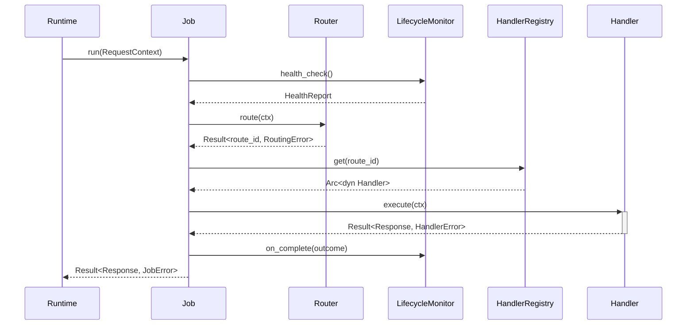
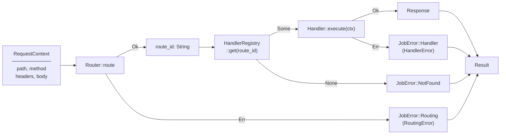

# Architecture — edge-proxy

## Sequence

> The runtime calls `Job::run` per request; the proxy routes it, checks lifecycle health, dispatches to a handler, and reports completion.

## Data Flow

> An inbound `RequestContext` is classified by `Router`, resolved to a handler, and the handler's response flows back through the `Job` boundary.

